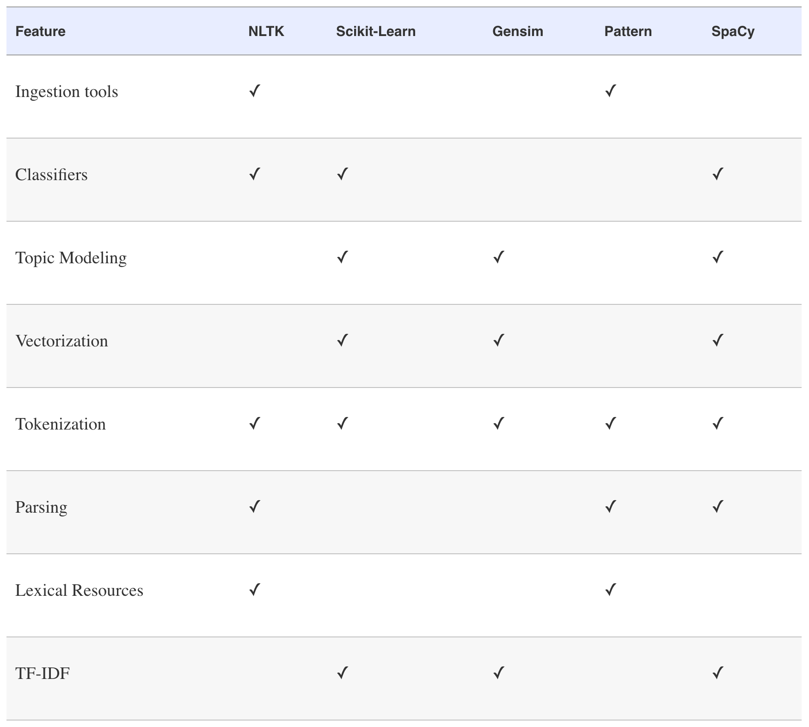

# Resources for Learning Natural Language Processing

##General NLP in Python
- [Applied Text Analysis with Python (Book)](https://www.safaribooksonline.com/library/view/applied-text-analysis/9781491963036/) by  Benjamin Bengfort, Tony Ojeda, Rebecca Bilbro
- [Natural Language Text Processing with Python (Video Series](https://player.oreilly.com/videos/9781491976470) by Jonathan Mugan
- [Natural Language Processing with Python (Book)](http://shop.oreilly.com/product/9780596516499.do) by Steven Bird, Ewan Klein, Edward Loper

##SpaCy
- [Learning Path: Mastering SpaCy for Natural Language Processing (Video Series)](https://www.safaribooksonline.com/library/view/learning-path-mastering/9781491986653/) by Aaron Kramer
- [Natural Language Processing Made Easy – using SpaCy (​in Python) (Article)](https://www.analyticsvidhya.com/blog/2017/04/natural-language-processing-made-easy-using-spacy-%E2%80%8Bin-python/) by SHIVAM BANSAL 

- Many other good tutorials on SpaCy can be found on the SpaCy site: [https://spacy.io/docs/usage/tutorials](https://spacy.io/docs/usage/tutorials)

## Pipelines in Scikit Learn
- [Using scikit-learn Pipelines and FeatureUnions](http://zacstewart.com/2014/08/05/pipelines-of-featureunions-of-pipelines.html) by Zac Stewart
- [WORKFLOWS IN PYTHON: USING PIPELINE AND GRIDSEARCHCV FOR MORE COMPACT AND COMPREHENSIVE CODE](https://www.civisanalytics.com/blog/workflows-in-python-using-pipeline-and-gridsearchcv-for-more-compact-and-comprehensive-code/) by Katie M.

## Miscellaneous
- [Language Exploration Using Vector Space Models](http://www.johnwittenauer.net/language-exploration-using-vector-space-models/) by John Wittenauer
- Interesting article on latent semantic analysis by 538 [Dissecting Trump’s Most Rabid Online Following](https://fivethirtyeight.com/features/dissecting-trumps-most-rabid-online-following/)
- [Introduction to Information Retrieval](https://nlp.stanford.edu/IR-book/) by Christopher D. Manning, Prabhakar Raghavan and Hinrich Schütze

## Overview of NLP Tools in Python

*Chart above from Applied Text Analysis with Python
by Benjamin Bengfort , Rebecca Bilbro , and Tony Ojeda, O’Reilly Media, Inc.*
