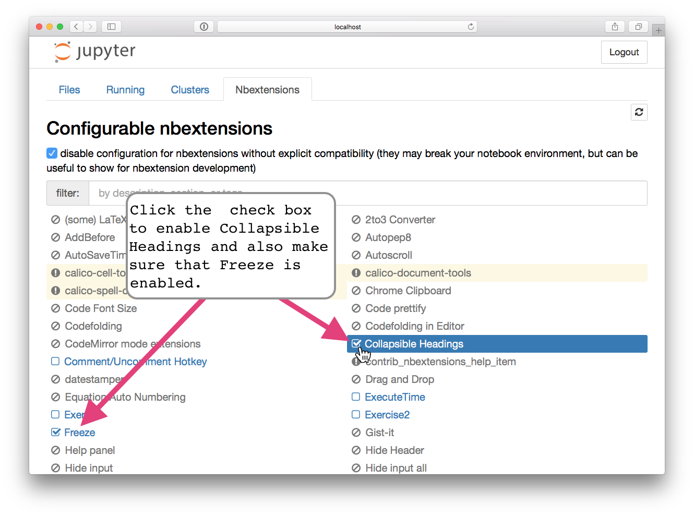

# Intro to Natural Language Processing
## Setup Instructions

There are two ways to get setup for the NLP training session. The recommended option is to setup a python environment on your local computer. 

### Virtual Machine Setup (Alternative)
If you are unable to perform the recommended install option (below), you can use a Linux virtual machine preconfigured with everything needed for the class. To go this route, download and install VirtualBox on your system: 
[https://www.virtualbox.org/wiki/Downloads](https://www.virtualbox.org/wiki/Downloads). 

Then, download the file for the preconfigured virtual machine here: [https://s3.amazonaws.com/farcon-nlp/NLP+Environment+64-bit.ova.7z](https://s3.amazonaws.com/farcon-nlp/NLP+Environment+64-bit.ova.7z). If you are having trouble unzipping the file use [http://www.7-zip.org/download.html](http://www.7-zip.org/download.html). Once you unzip the file you should be able to open it with VirtualBox and start the virtual machine. There is no need to download any other files mentioned in the steps below, as they are already included in the virtual machine.


-----------------------
### Local Install Setup (Recommended)

I'm using Conda to manage and create the python environment. For an in-depth explanation of this workflow see the excellent bog post by Tim Hopper, [My Python Environment Workflow with Conda](https://tdhopper.com/blog/2015/Nov/24/my-python-environment-workflow-with-conda/).


Here is a video walk-through of the steps below on a Mac: [https://vimeo.com/230225216](https://vimeo.com/230225216).

### 1. Install Anaconda or MiniConda
*If you already have Anaconda or Miniconda installed, skip to step 2.*

#### Install Anaconda (Recommended)
Download the python 3.6 version of Anaconda for your system from here:
[https://www.continuum.io/downloads](https://www.continuum.io/downloads)

Follow the setup instructions on the Anaconda site.

#### Or Install Miniconda (Takes up Less Space)
If you have limited space on your system you can download Miniconda. This will only install what is needed for the training session and will skip many of the components that are included in the full version of Anaconda. Follow these instructions to install Miniconda on your system: 
[https://conda.io/docs/install/quick.html](https://conda.io/docs/install/quick.html)


### 2. Clone the Training Repository
Use git to clone the repository for the training session down to your computer. Here is the link to the main repository: [https://github.com/juskaiser/FARCON_NLP](https://github.com/juskaiser/FARCON_NLP).

Navigate to your desired installation location in command line and clone the repository with the following commands:

**Via HTTPS:** ```$ git clone https://github.com/juskaiser/FARCON_NLP.git```

Or

**Via SSH:** ```$ git clone git@github.com:juskaiser/FARCON_NLP.git```


### 3. Create your Local Environment
In command line, navigate to the folder for the training session that was just cloned. It should be called *FARCON_NLP* unless it was changed. Run ```$ ls``` from within the directory in command line, you should see a result like this:

```
$ ls
README.md   Test.ipynb  data    environment.yml
```
**Note: there may be additional files to those listed above.*

In command line, from within the *FARCON_NLP* folder, run the following command:

```$ conda env create -f environment.yml ```

This will download and install the python packages needed for the training session and may take a few minutes, depending on the speed of your internet connection. 

See *Use environment from file* in the conda documentation for troubleshooting & reference:
[https://conda.io/docs/using/envs.html#use-environment-from-file](https://conda.io/docs/using/envs.html#use-environment-from-file)

### 4. Verify and Activate the New Environment
To verify the new conda environment was created, run the following command in command line:

```
$ conda env list
```
You should see a result like this:

```
# conda environments:
#
far_nlp                  /Users/Justin/anaconda/envs/far_nlp
root                  *  /Users/Justin/anaconda
```

The new conda environment (*far_nlp*) should be listed. **The asterisk indicates the current active environment.**

Activate the new environment with the following command:

**OS X, Linux:** ```$ source activate far_nlp```

**Windows:** ```$ activate far_nlp```

Now, run ```$ conda env list ``` a second time to verify the new environment is active. You should see that the asterisk is now on the line for *far_nlp*, indicating the new environment is active.

```
# conda environments:
#
far_nlp               *  /Users/Justin/anaconda/envs/far_nlp
root                     /Users/Justin/anaconda
```

See the conda documentation for more info on managing and switching between environments:
[https://conda.io/docs/using/envs.html](https://conda.io/docs/using/envs.html#)

### 4. Install the English Model for spaCy
**Before proceeding, make sure the new conda environment, *far_nlp*, is activated (see the previous step).** The spaCy NLP package was already installed in previous step, but you need to manually install the English language model for spaCy. Install the English model by entering the following command in command line:

```$ python -m spacy download en```

**Note: you can enter this command from any location in the command line.*

SpaCy installation instructions for troubleshooting & reference:
[https://spacy.io/docs/usage/](https://spacy.io/docs/usage/)
### 5. Download the Data
Download the data we'll use in the session from the link below. Unzip the file and place each unzipped data file in the data directory within FARCON_NLP.

**Data for NLP training session:** [https://s3.amazonaws.com/farcon-nlp/data.zip](https://s3.amazonaws.com/farcon-nlp/data.zip)

The structure for the FARCON_NLP directory should look like this after you've copied in the unzipped data files:

```
FARCON_NLP
├── README.md
├── Test.ipynb
├── data
│   ├── amazon_electronics_reviews_subset.csv
│   └── sandisk_sd_card_reviews.csv
├── environment.yml
└── utilities.py
```

### 6. Configure Jupyter Notebook and Run the Test Notebook
Navigate to the FARCON_NLP directory in command line. From within the directory start Jupyter Notebook by running this command from command line:
 
```
$ jupyter notebook
```

If your default browser doesn't launch with the Jupyter Notebook home page automatically, check back in your terminal window. You'll probably see an error message like this:

```
Copy/paste this URL into your browser when you connect for the first time, to login with a token:

http://localhost:8888/?token=cf6d21cbb1fbd2c1ce677607c2300bf56e213b93917efc15
69:77: 

execution error: Can’t get application "chrome". (-1728)
```
Follow the error instructions and copy the full link containing the security token into your browser address bar and hit enter. Your browser should then load the Jupyter Notebook home screen, as shown below:


#### Enable Extensions

Click the tab named Nbextensions to go to the settings page for Jupyter Notebook extensions.


Click the check box to enable *Collapsible Headings*. Also make sure that *Freeze* is enabled (it should be enabled by default). *Collapsible Headings* and *Freeze* are an extra features in Jupyter notebook that will be helpful in the main notebook for the training session.    




#### Now Run the Test Notebook
Let's use Jupyter Notebook to perform some tests on our installation. Navigate back to the Jupyter Notebook home location by clicking the *Files* tab. Then, Click on *Test.ipynb* to launch the *Test* notebook: 


Once the *Test* notebook is open press ```shift + enter``` to run the cell and proceed to the next cell. Continue on and hit ```shift + enter``` for each cell in the notebook. If each cell runs without any errors, your installation should be good. Below is what the notebook should look like after running each cell successfully.


#### For a More Thorough Test:
You can perform a more in-depth installation test for spaCy by following these instructions:
[https://spacy.io/docs/usage/#tests](https://spacy.io/docs/usage/#tests)

You can do the same for sci-kit learn by following these instructions:
[http://scikit-learn.org/stable/developers/advanced_installation.html#testing](http://scikit-learn.org/stable/developers/advanced_installation.html#testing)

Each of these tests take a few minutes to run.